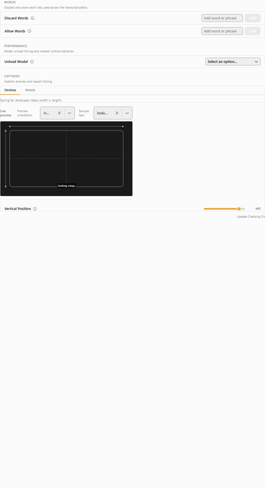

# Settings UI consistency audit

Generated: 04/18/2026 23:43:02  
Runtime: 20.7s  
Totals: critical=0 major=130 minor=0 (total=130)

## Summary by page × severity

| Page | Critical | Major | Minor |
|------|---------:|------:|------:|
| about | 0 | 18 | 0 |
| advanced | 0 | 48 | 0 |
| captions | 0 | 48 | 0 |
| post-process | 0 | 16 | 0 |

## Page: about

### major (18)

- rule: `R-003-layout` viewport: `desktop-1280x800`
  ```json
{
  "selector": "[data-testid=\"setting-row\"]:nth-of-type(4)",
  "expected": {
    "display": "flex|grid",
    "flexDirection": "row (if flex)",
    "gridTracks": ">=2 (if grid)"
  },
  "actual": {
    "display": "block",
    "flexDirection": "row",
    "gridTemplateColumns": "none"
  },
  "fileHint": "src/components/settings/about/AboutSettings.tsx"
}
  ```
  

- rule: `R-003-layout` viewport: `desktop-1280x800`
  ```json
{
  "selector": "[data-testid=\"setting-row\"]:nth-of-type(5)",
  "expected": {
    "display": "flex|grid",
    "flexDirection": "row (if flex)",
    "gridTracks": ">=2 (if grid)"
  },
  "actual": {
    "display": "block",
    "flexDirection": "row",
    "gridTemplateColumns": "none"
  },
  "fileHint": "src/components/settings/about/AboutSettings.tsx"
}
  ```
  

- rule: `R-003-layout` viewport: `desktop-1280x800`
  ```json
{
  "selector": "[data-testid=\"setting-row\"]:nth-of-type(6)",
  "expected": {
    "display": "flex|grid",
    "flexDirection": "row (if flex)",
    "gridTracks": ">=2 (if grid)"
  },
  "actual": {
    "display": "block",
    "flexDirection": "row",
    "gridTemplateColumns": "none"
  },
  "fileHint": "src/components/settings/about/AboutSettings.tsx"
}
  ```
  

- rule: `R-003-layout` viewport: `desktop-1280x800`
  ```json
{
  "selector": "[data-testid=\"setting-row\"]:nth-of-type(7)",
  "expected": {
    "display": "flex|grid",
    "flexDirection": "row (if flex)",
    "gridTracks": ">=2 (if grid)"
  },
  "actual": {
    "display": "block",
    "flexDirection": "row",
    "gridTemplateColumns": "none"
  },
  "fileHint": "src/components/settings/about/AboutSettings.tsx"
}
  ```
  

- rule: `R-005-missing-description` viewport: `desktop-1280x800`
  ```json
{
  "selector": "[data-testid=\"setting-row\"]:nth-of-type(1)",
  "expected": {
    "descriptionPresent": true,
    "descriptionNonEmpty": true
  },
  "actual": {
    "descriptionPresent": false,
    "descriptionText": null
  },
  "fileHint": "src/components/settings/about/AboutSettings.tsx"
}
  ```
  

- rule: `R-005-missing-description` viewport: `mobile-portrait-390x844`
  ```json
{
  "selector": "[data-testid=\"setting-row\"]:nth-of-type(1)",
  "expected": {
    "descriptionPresent": true,
    "descriptionNonEmpty": true
  },
  "actual": {
    "descriptionPresent": false,
    "descriptionText": null
  },
  "fileHint": "src/components/settings/about/AboutSettings.tsx"
}
  ```
  

- rule: `R-005-missing-description` viewport: `desktop-1280x800`
  ```json
{
  "selector": "[data-testid=\"setting-row\"]:nth-of-type(2)",
  "expected": {
    "descriptionPresent": true,
    "descriptionNonEmpty": true
  },
  "actual": {
    "descriptionPresent": false,
    "descriptionText": null
  },
  "fileHint": "src/components/settings/about/AboutSettings.tsx"
}
  ```
  

- rule: `R-005-missing-description` viewport: `mobile-portrait-390x844`
  ```json
{
  "selector": "[data-testid=\"setting-row\"]:nth-of-type(2)",
  "expected": {
    "descriptionPresent": true,
    "descriptionNonEmpty": true
  },
  "actual": {
    "descriptionPresent": false,
    "descriptionText": null
  },
  "fileHint": "src/components/settings/about/AboutSettings.tsx"
}
  ```
  

- rule: `R-005-missing-description` viewport: `mobile-portrait-390x844`
  ```json
{
  "selector": "[data-testid=\"setting-row\"]:nth-of-type(3)",
  "expected": {
    "descriptionPresent": true,
    "descriptionNonEmpty": true
  },
  "actual": {
    "descriptionPresent": false,
    "descriptionText": null
  },
  "fileHint": "src/components/settings/about/AboutSettings.tsx"
}
  ```
  

- rule: `R-005-missing-description` viewport: `desktop-1280x800`
  ```json
{
  "selector": "[data-testid=\"setting-row\"]:nth-of-type(3)",
  "expected": {
    "descriptionPresent": true,
    "descriptionNonEmpty": true
  },
  "actual": {
    "descriptionPresent": false,
    "descriptionText": null
  },
  "fileHint": "src/components/settings/about/AboutSettings.tsx"
}
  ```
  

- rule: `R-005-missing-description` viewport: `desktop-1280x800`
  ```json
{
  "selector": "[data-testid=\"setting-row\"]:nth-of-type(4)",
  "expected": {
    "descriptionPresent": true,
    "descriptionNonEmpty": true
  },
  "actual": {
    "descriptionPresent": false,
    "descriptionText": null
  },
  "fileHint": "src/components/settings/about/AboutSettings.tsx"
}
  ```
  

- rule: `R-005-missing-description` viewport: `mobile-portrait-390x844`
  ```json
{
  "selector": "[data-testid=\"setting-row\"]:nth-of-type(4)",
  "expected": {
    "descriptionPresent": true,
    "descriptionNonEmpty": true
  },
  "actual": {
    "descriptionPresent": false,
    "descriptionText": null
  },
  "fileHint": "src/components/settings/about/AboutSettings.tsx"
}
  ```
  

- rule: `R-005-missing-description` viewport: `desktop-1280x800`
  ```json
{
  "selector": "[data-testid=\"setting-row\"]:nth-of-type(5)",
  "expected": {
    "descriptionPresent": true,
    "descriptionNonEmpty": true
  },
  "actual": {
    "descriptionPresent": false,
    "descriptionText": null
  },
  "fileHint": "src/components/settings/about/AboutSettings.tsx"
}
  ```
  

- rule: `R-005-missing-description` viewport: `mobile-portrait-390x844`
  ```json
{
  "selector": "[data-testid=\"setting-row\"]:nth-of-type(5)",
  "expected": {
    "descriptionPresent": true,
    "descriptionNonEmpty": true
  },
  "actual": {
    "descriptionPresent": false,
    "descriptionText": null
  },
  "fileHint": "src/components/settings/about/AboutSettings.tsx"
}
  ```
  

- rule: `R-005-missing-description` viewport: `desktop-1280x800`
  ```json
{
  "selector": "[data-testid=\"setting-row\"]:nth-of-type(6)",
  "expected": {
    "descriptionPresent": true,
    "descriptionNonEmpty": true
  },
  "actual": {
    "descriptionPresent": false,
    "descriptionText": null
  },
  "fileHint": "src/components/settings/about/AboutSettings.tsx"
}
  ```
  

- rule: `R-005-missing-description` viewport: `mobile-portrait-390x844`
  ```json
{
  "selector": "[data-testid=\"setting-row\"]:nth-of-type(6)",
  "expected": {
    "descriptionPresent": true,
    "descriptionNonEmpty": true
  },
  "actual": {
    "descriptionPresent": false,
    "descriptionText": null
  },
  "fileHint": "src/components/settings/about/AboutSettings.tsx"
}
  ```
  

- rule: `R-005-missing-description` viewport: `mobile-portrait-390x844`
  ```json
{
  "selector": "[data-testid=\"setting-row\"]:nth-of-type(7)",
  "expected": {
    "descriptionPresent": true,
    "descriptionNonEmpty": true
  },
  "actual": {
    "descriptionPresent": false,
    "descriptionText": null
  },
  "fileHint": "src/components/settings/about/AboutSettings.tsx"
}
  ```
  

- rule: `R-005-missing-description` viewport: `desktop-1280x800`
  ```json
{
  "selector": "[data-testid=\"setting-row\"]:nth-of-type(7)",
  "expected": {
    "descriptionPresent": true,
    "descriptionNonEmpty": true
  },
  "actual": {
    "descriptionPresent": false,
    "descriptionText": null
  },
  "fileHint": "src/components/settings/about/AboutSettings.tsx"
}
  ```
  

## Page: advanced

### major (48)

- rule: `R-003-export-two-column` viewport: `desktop-1280x800`
  ```json
{
  "selector": "[data-testid=\"setting-row\"]:nth-of-type(14)",
  "expected": {
    "display": "flex|grid",
    "flexDirection": "row (if flex)",
    "gridTracks": ">=2 (if grid)"
  },
  "actual": {
    "display": "block",
    "flexDirection": "row",
    "gridTemplateColumns": "none"
  },
  "fileHint": "src/components/settings/advanced/AdvancedSettings.tsx"
}
  ```
  

- rule: `R-003-export-two-column` viewport: `desktop-1280x800`
  ```json
{
  "selector": "[data-testid=\"setting-row\"]:nth-of-type(15)",
  "expected": {
    "display": "flex|grid",
    "flexDirection": "row (if flex)",
    "gridTracks": ">=2 (if grid)"
  },
  "actual": {
    "display": "block",
    "flexDirection": "row",
    "gridTemplateColumns": "none"
  },
  "fileHint": "src/components/settings/advanced/AdvancedSettings.tsx"
}
  ```
  

- rule: `R-003-export-two-column` viewport: `desktop-1280x800`
  ```json
{
  "selector": "[data-testid=\"setting-row\"]:nth-of-type(16)",
  "expected": {
    "display": "flex|grid",
    "flexDirection": "row (if flex)",
    "gridTracks": ">=2 (if grid)"
  },
  "actual": {
    "display": "block",
    "flexDirection": "row",
    "gridTemplateColumns": "none"
  },
  "fileHint": "src/components/settings/advanced/AdvancedSettings.tsx"
}
  ```
  

- rule: `R-003-export-two-column` viewport: `desktop-1280x800`
  ```json
{
  "selector": "[data-testid=\"setting-row\"]:nth-of-type(17)",
  "expected": {
    "display": "flex|grid",
    "flexDirection": "row (if flex)",
    "gridTracks": ">=2 (if grid)"
  },
  "actual": {
    "display": "block",
    "flexDirection": "row",
    "gridTemplateColumns": "none"
  },
  "fileHint": "src/components/settings/advanced/AdvancedSettings.tsx"
}
  ```
  

- rule: `R-005-color-light-grey-on-white` viewport: `desktop-1280x800`
  ```json
{
  "selector": "[data-testid=\"settings-outer\"] button",
  "expected": {
    "readableContrast": true
  },
  "actual": {
    "text": "Run preflight",
    "colorHSL": [
      0,
      0,
      1
    ],
    "bgHSL": [
      0,
      0,
      0.984313725490196
    ]
  },
  "fileHint": "src/components/settings/advanced/AdvancedSettings.tsx"
}
  ```
  

- rule: `R-005-color-light-grey-on-white` viewport: `mobile-portrait-390x844`
  ```json
{
  "selector": "[data-testid=\"settings-outer\"] button",
  "expected": {
    "readableContrast": true
  },
  "actual": {
    "text": "Run preflight",
    "colorHSL": [
      0,
      0,
      1
    ],
    "bgHSL": [
      0,
      0,
      0.984313725490196
    ]
  },
  "fileHint": "src/components/settings/advanced/AdvancedSettings.tsx"
}
  ```
  

- rule: `R-005-missing-description` viewport: `desktop-1280x800`
  ```json
{
  "selector": "[data-testid=\"setting-row\"]:nth-of-type(1)",
  "expected": {
    "descriptionPresent": true,
    "descriptionNonEmpty": true
  },
  "actual": {
    "descriptionPresent": false,
    "descriptionText": null
  },
  "fileHint": "src/components/settings/advanced/AdvancedSettings.tsx"
}
  ```
  

- rule: `R-005-missing-description` viewport: `mobile-portrait-390x844`
  ```json
{
  "selector": "[data-testid=\"setting-row\"]:nth-of-type(1)",
  "expected": {
    "descriptionPresent": true,
    "descriptionNonEmpty": true
  },
  "actual": {
    "descriptionPresent": false,
    "descriptionText": null
  },
  "fileHint": "src/components/settings/advanced/AdvancedSettings.tsx"
}
  ```
  

- rule: `R-005-missing-description` viewport: `desktop-1280x800`
  ```json
{
  "selector": "[data-testid=\"setting-row\"]:nth-of-type(10)",
  "expected": {
    "descriptionPresent": true,
    "descriptionNonEmpty": true
  },
  "actual": {
    "descriptionPresent": false,
    "descriptionText": null
  },
  "fileHint": "src/components/settings/advanced/AdvancedSettings.tsx"
}
  ```
  

- rule: `R-005-missing-description` viewport: `mobile-portrait-390x844`
  ```json
{
  "selector": "[data-testid=\"setting-row\"]:nth-of-type(10)",
  "expected": {
    "descriptionPresent": true,
    "descriptionNonEmpty": true
  },
  "actual": {
    "descriptionPresent": false,
    "descriptionText": null
  },
  "fileHint": "src/components/settings/advanced/AdvancedSettings.tsx"
}
  ```
  

- rule: `R-005-missing-description` viewport: `desktop-1280x800`
  ```json
{
  "selector": "[data-testid=\"setting-row\"]:nth-of-type(11)",
  "expected": {
    "descriptionPresent": true,
    "descriptionNonEmpty": true
  },
  "actual": {
    "descriptionPresent": false,
    "descriptionText": null
  },
  "fileHint": "src/components/settings/advanced/AdvancedSettings.tsx"
}
  ```
  

- rule: `R-005-missing-description` viewport: `mobile-portrait-390x844`
  ```json
{
  "selector": "[data-testid=\"setting-row\"]:nth-of-type(11)",
  "expected": {
    "descriptionPresent": true,
    "descriptionNonEmpty": true
  },
  "actual": {
    "descriptionPresent": false,
    "descriptionText": null
  },
  "fileHint": "src/components/settings/advanced/AdvancedSettings.tsx"
}
  ```
  

- rule: `R-005-missing-description` viewport: `desktop-1280x800`
  ```json
{
  "selector": "[data-testid=\"setting-row\"]:nth-of-type(12)",
  "expected": {
    "descriptionPresent": true,
    "descriptionNonEmpty": true
  },
  "actual": {
    "descriptionPresent": false,
    "descriptionText": null
  },
  "fileHint": "src/components/settings/advanced/AdvancedSettings.tsx"
}
  ```
  

- rule: `R-005-missing-description` viewport: `mobile-portrait-390x844`
  ```json
{
  "selector": "[data-testid=\"setting-row\"]:nth-of-type(12)",
  "expected": {
    "descriptionPresent": true,
    "descriptionNonEmpty": true
  },
  "actual": {
    "descriptionPresent": false,
    "descriptionText": null
  },
  "fileHint": "src/components/settings/advanced/AdvancedSettings.tsx"
}
  ```
  

- rule: `R-005-missing-description` viewport: `mobile-portrait-390x844`
  ```json
{
  "selector": "[data-testid=\"setting-row\"]:nth-of-type(13)",
  "expected": {
    "descriptionPresent": true,
    "descriptionNonEmpty": true
  },
  "actual": {
    "descriptionPresent": false,
    "descriptionText": null
  },
  "fileHint": "src/components/settings/advanced/AdvancedSettings.tsx"
}
  ```
  

- rule: `R-005-missing-description` viewport: `desktop-1280x800`
  ```json
{
  "selector": "[data-testid=\"setting-row\"]:nth-of-type(13)",
  "expected": {
    "descriptionPresent": true,
    "descriptionNonEmpty": true
  },
  "actual": {
    "descriptionPresent": false,
    "descriptionText": null
  },
  "fileHint": "src/components/settings/advanced/AdvancedSettings.tsx"
}
  ```
  

- rule: `R-005-missing-description` viewport: `desktop-1280x800`
  ```json
{
  "selector": "[data-testid=\"setting-row\"]:nth-of-type(18)",
  "expected": {
    "descriptionPresent": true,
    "descriptionNonEmpty": true
  },
  "actual": {
    "descriptionPresent": false,
    "descriptionText": null
  },
  "fileHint": "src/components/settings/advanced/AdvancedSettings.tsx"
}
  ```
  

- rule: `R-005-missing-description` viewport: `mobile-portrait-390x844`
  ```json
{
  "selector": "[data-testid=\"setting-row\"]:nth-of-type(18)",
  "expected": {
    "descriptionPresent": true,
    "descriptionNonEmpty": true
  },
  "actual": {
    "descriptionPresent": false,
    "descriptionText": null
  },
  "fileHint": "src/components/settings/advanced/AdvancedSettings.tsx"
}
  ```
  

- rule: `R-005-missing-description` viewport: `desktop-1280x800`
  ```json
{
  "selector": "[data-testid=\"setting-row\"]:nth-of-type(2)",
  "expected": {
    "descriptionPresent": true,
    "descriptionNonEmpty": true
  },
  "actual": {
    "descriptionPresent": false,
    "descriptionText": null
  },
  "fileHint": "src/components/settings/advanced/AdvancedSettings.tsx"
}
  ```
  

- rule: `R-005-missing-description` viewport: `mobile-portrait-390x844`
  ```json
{
  "selector": "[data-testid=\"setting-row\"]:nth-of-type(2)",
  "expected": {
    "descriptionPresent": true,
    "descriptionNonEmpty": true
  },
  "actual": {
    "descriptionPresent": false,
    "descriptionText": null
  },
  "fileHint": "src/components/settings/advanced/AdvancedSettings.tsx"
}
  ```
  

- rule: `R-005-missing-description` viewport: `desktop-1280x800`
  ```json
{
  "selector": "[data-testid=\"setting-row\"]:nth-of-type(3)",
  "expected": {
    "descriptionPresent": true,
    "descriptionNonEmpty": true
  },
  "actual": {
    "descriptionPresent": false,
    "descriptionText": null
  },
  "fileHint": "src/components/settings/advanced/AdvancedSettings.tsx"
}
  ```
  

- rule: `R-005-missing-description` viewport: `mobile-portrait-390x844`
  ```json
{
  "selector": "[data-testid=\"setting-row\"]:nth-of-type(3)",
  "expected": {
    "descriptionPresent": true,
    "descriptionNonEmpty": true
  },
  "actual": {
    "descriptionPresent": false,
    "descriptionText": null
  },
  "fileHint": "src/components/settings/advanced/AdvancedSettings.tsx"
}
  ```
  

- rule: `R-005-missing-description` viewport: `desktop-1280x800`
  ```json
{
  "selector": "[data-testid=\"setting-row\"]:nth-of-type(4)",
  "expected": {
    "descriptionPresent": true,
    "descriptionNonEmpty": true
  },
  "actual": {
    "descriptionPresent": false,
    "descriptionText": null
  },
  "fileHint": "src/components/settings/advanced/AdvancedSettings.tsx"
}
  ```
  

- rule: `R-005-missing-description` viewport: `mobile-portrait-390x844`
  ```json
{
  "selector": "[data-testid=\"setting-row\"]:nth-of-type(4)",
  "expected": {
    "descriptionPresent": true,
    "descriptionNonEmpty": true
  },
  "actual": {
    "descriptionPresent": false,
    "descriptionText": null
  },
  "fileHint": "src/components/settings/advanced/AdvancedSettings.tsx"
}
  ```
  

- rule: `R-005-missing-description` viewport: `desktop-1280x800`
  ```json
{
  "selector": "[data-testid=\"setting-row\"]:nth-of-type(5)",
  "expected": {
    "descriptionPresent": true,
    "descriptionNonEmpty": true
  },
  "actual": {
    "descriptionPresent": false,
    "descriptionText": null
  },
  "fileHint": "src/components/settings/advanced/AdvancedSettings.tsx"
}
  ```
  

- rule: `R-005-missing-description` viewport: `mobile-portrait-390x844`
  ```json
{
  "selector": "[data-testid=\"setting-row\"]:nth-of-type(5)",
  "expected": {
    "descriptionPresent": true,
    "descriptionNonEmpty": true
  },
  "actual": {
    "descriptionPresent": false,
    "descriptionText": null
  },
  "fileHint": "src/components/settings/advanced/AdvancedSettings.tsx"
}
  ```
  

- rule: `R-005-missing-description` viewport: `desktop-1280x800`
  ```json
{
  "selector": "[data-testid=\"setting-row\"]:nth-of-type(6)",
  "expected": {
    "descriptionPresent": true,
    "descriptionNonEmpty": true
  },
  "actual": {
    "descriptionPresent": false,
    "descriptionText": null
  },
  "fileHint": "src/components/settings/advanced/AdvancedSettings.tsx"
}
  ```
  

- rule: `R-005-missing-description` viewport: `mobile-portrait-390x844`
  ```json
{
  "selector": "[data-testid=\"setting-row\"]:nth-of-type(6)",
  "expected": {
    "descriptionPresent": true,
    "descriptionNonEmpty": true
  },
  "actual": {
    "descriptionPresent": false,
    "descriptionText": null
  },
  "fileHint": "src/components/settings/advanced/AdvancedSettings.tsx"
}
  ```
  

- rule: `R-005-missing-description` viewport: `desktop-1280x800`
  ```json
{
  "selector": "[data-testid=\"setting-row\"]:nth-of-type(7)",
  "expected": {
    "descriptionPresent": true,
    "descriptionNonEmpty": true
  },
  "actual": {
    "descriptionPresent": false,
    "descriptionText": null
  },
  "fileHint": "src/components/settings/advanced/AdvancedSettings.tsx"
}
  ```
  

- rule: `R-005-missing-description` viewport: `mobile-portrait-390x844`
  ```json
{
  "selector": "[data-testid=\"setting-row\"]:nth-of-type(7)",
  "expected": {
    "descriptionPresent": true,
    "descriptionNonEmpty": true
  },
  "actual": {
    "descriptionPresent": false,
    "descriptionText": null
  },
  "fileHint": "src/components/settings/advanced/AdvancedSettings.tsx"
}
  ```
  

- rule: `R-005-missing-description` viewport: `mobile-portrait-390x844`
  ```json
{
  "selector": "[data-testid=\"setting-row\"]:nth-of-type(8)",
  "expected": {
    "descriptionPresent": true,
    "descriptionNonEmpty": true
  },
  "actual": {
    "descriptionPresent": false,
    "descriptionText": null
  },
  "fileHint": "src/components/settings/advanced/AdvancedSettings.tsx"
}
  ```
  

- rule: `R-005-missing-description` viewport: `desktop-1280x800`
  ```json
{
  "selector": "[data-testid=\"setting-row\"]:nth-of-type(8)",
  "expected": {
    "descriptionPresent": true,
    "descriptionNonEmpty": true
  },
  "actual": {
    "descriptionPresent": false,
    "descriptionText": null
  },
  "fileHint": "src/components/settings/advanced/AdvancedSettings.tsx"
}
  ```
  

- rule: `R-005-missing-description` viewport: `desktop-1280x800`
  ```json
{
  "selector": "[data-testid=\"setting-row\"]:nth-of-type(9)",
  "expected": {
    "descriptionPresent": true,
    "descriptionNonEmpty": true
  },
  "actual": {
    "descriptionPresent": false,
    "descriptionText": null
  },
  "fileHint": "src/components/settings/advanced/AdvancedSettings.tsx"
}
  ```
  

- rule: `R-005-missing-description` viewport: `mobile-portrait-390x844`
  ```json
{
  "selector": "[data-testid=\"setting-row\"]:nth-of-type(9)",
  "expected": {
    "descriptionPresent": true,
    "descriptionNonEmpty": true
  },
  "actual": {
    "descriptionPresent": false,
    "descriptionText": null
  },
  "fileHint": "src/components/settings/advanced/AdvancedSettings.tsx"
}
  ```
  

- rule: `R-005-range-editable` viewport: `desktop-1280x800`
  ```json
{
  "selector": "[data-testid=\"setting-row\"]:nth-of-type(10) input[type=\"range\"]",
  "expected": {
    "hasNumberInputOrContenteditable": true
  },
  "actual": {
    "numberInputs": 0,
    "contenteditable": 0
  },
  "fileHint": "src/components/settings/advanced/AdvancedSettings.tsx"
}
  ```
  

- rule: `R-005-range-editable` viewport: `mobile-portrait-390x844`
  ```json
{
  "selector": "[data-testid=\"setting-row\"]:nth-of-type(10) input[type=\"range\"]",
  "expected": {
    "hasNumberInputOrContenteditable": true
  },
  "actual": {
    "numberInputs": 0,
    "contenteditable": 0
  },
  "fileHint": "src/components/settings/advanced/AdvancedSettings.tsx"
}
  ```
  

- rule: `R-005-range-editable` viewport: `desktop-1280x800`
  ```json
{
  "selector": "[data-testid=\"setting-row\"]:nth-of-type(11) input[type=\"range\"]",
  "expected": {
    "hasNumberInputOrContenteditable": true
  },
  "actual": {
    "numberInputs": 0,
    "contenteditable": 0
  },
  "fileHint": "src/components/settings/advanced/AdvancedSettings.tsx"
}
  ```
  

- rule: `R-005-range-editable` viewport: `mobile-portrait-390x844`
  ```json
{
  "selector": "[data-testid=\"setting-row\"]:nth-of-type(11) input[type=\"range\"]",
  "expected": {
    "hasNumberInputOrContenteditable": true
  },
  "actual": {
    "numberInputs": 0,
    "contenteditable": 0
  },
  "fileHint": "src/components/settings/advanced/AdvancedSettings.tsx"
}
  ```
  

- rule: `R-005-range-editable` viewport: `desktop-1280x800`
  ```json
{
  "selector": "[data-testid=\"setting-row\"]:nth-of-type(12) input[type=\"range\"]",
  "expected": {
    "hasNumberInputOrContenteditable": true
  },
  "actual": {
    "numberInputs": 0,
    "contenteditable": 0
  },
  "fileHint": "src/components/settings/advanced/AdvancedSettings.tsx"
}
  ```
  

- rule: `R-005-range-editable` viewport: `mobile-portrait-390x844`
  ```json
{
  "selector": "[data-testid=\"setting-row\"]:nth-of-type(12) input[type=\"range\"]",
  "expected": {
    "hasNumberInputOrContenteditable": true
  },
  "actual": {
    "numberInputs": 0,
    "contenteditable": 0
  },
  "fileHint": "src/components/settings/advanced/AdvancedSettings.tsx"
}
  ```
  

- rule: `R-005-range-editable` viewport: `desktop-1280x800`
  ```json
{
  "selector": "[data-testid=\"setting-row\"]:nth-of-type(13) input[type=\"range\"]",
  "expected": {
    "hasNumberInputOrContenteditable": true
  },
  "actual": {
    "numberInputs": 0,
    "contenteditable": 0
  },
  "fileHint": "src/components/settings/advanced/AdvancedSettings.tsx"
}
  ```
  

- rule: `R-005-range-editable` viewport: `mobile-portrait-390x844`
  ```json
{
  "selector": "[data-testid=\"setting-row\"]:nth-of-type(13) input[type=\"range\"]",
  "expected": {
    "hasNumberInputOrContenteditable": true
  },
  "actual": {
    "numberInputs": 0,
    "contenteditable": 0
  },
  "fileHint": "src/components/settings/advanced/AdvancedSettings.tsx"
}
  ```
  

- rule: `R-005-range-editable` viewport: `desktop-1280x800`
  ```json
{
  "selector": "[data-testid=\"setting-row\"]:nth-of-type(4) input[type=\"range\"]",
  "expected": {
    "hasNumberInputOrContenteditable": true
  },
  "actual": {
    "numberInputs": 0,
    "contenteditable": 0
  },
  "fileHint": "src/components/settings/advanced/AdvancedSettings.tsx"
}
  ```
  

- rule: `R-005-range-editable` viewport: `mobile-portrait-390x844`
  ```json
{
  "selector": "[data-testid=\"setting-row\"]:nth-of-type(4) input[type=\"range\"]",
  "expected": {
    "hasNumberInputOrContenteditable": true
  },
  "actual": {
    "numberInputs": 0,
    "contenteditable": 0
  },
  "fileHint": "src/components/settings/advanced/AdvancedSettings.tsx"
}
  ```
  

- rule: `R-005-range-editable` viewport: `mobile-portrait-390x844`
  ```json
{
  "selector": "[data-testid=\"setting-row\"]:nth-of-type(5) input[type=\"range\"]",
  "expected": {
    "hasNumberInputOrContenteditable": true
  },
  "actual": {
    "numberInputs": 0,
    "contenteditable": 0
  },
  "fileHint": "src/components/settings/advanced/AdvancedSettings.tsx"
}
  ```
  

- rule: `R-005-range-editable` viewport: `desktop-1280x800`
  ```json
{
  "selector": "[data-testid=\"setting-row\"]:nth-of-type(5) input[type=\"range\"]",
  "expected": {
    "hasNumberInputOrContenteditable": true
  },
  "actual": {
    "numberInputs": 0,
    "contenteditable": 0
  },
  "fileHint": "src/components/settings/advanced/AdvancedSettings.tsx"
}
  ```
  

- rule: `R-005-range-editable` viewport: `mobile-portrait-390x844`
  ```json
{
  "selector": "[data-testid=\"setting-row\"]:nth-of-type(6) input[type=\"range\"]",
  "expected": {
    "hasNumberInputOrContenteditable": true
  },
  "actual": {
    "numberInputs": 0,
    "contenteditable": 0
  },
  "fileHint": "src/components/settings/advanced/AdvancedSettings.tsx"
}
  ```
  

- rule: `R-005-range-editable` viewport: `desktop-1280x800`
  ```json
{
  "selector": "[data-testid=\"setting-row\"]:nth-of-type(6) input[type=\"range\"]",
  "expected": {
    "hasNumberInputOrContenteditable": true
  },
  "actual": {
    "numberInputs": 0,
    "contenteditable": 0
  },
  "fileHint": "src/components/settings/advanced/AdvancedSettings.tsx"
}
  ```
  

## Page: captions

### major (48)

- rule: `R-003-layout` viewport: `desktop-1280x800`
  ```json
{
  "selector": "[data-testid=\"setting-row\"]:nth-of-type(14)",
  "expected": {
    "display": "flex|grid",
    "flexDirection": "row (if flex)",
    "gridTracks": ">=2 (if grid)"
  },
  "actual": {
    "display": "block",
    "flexDirection": "row",
    "gridTemplateColumns": "none"
  },
  "fileHint": "src/components/settings/advanced/AdvancedSettings.tsx"
}
  ```
  

- rule: `R-003-layout` viewport: `desktop-1280x800`
  ```json
{
  "selector": "[data-testid=\"setting-row\"]:nth-of-type(15)",
  "expected": {
    "display": "flex|grid",
    "flexDirection": "row (if flex)",
    "gridTracks": ">=2 (if grid)"
  },
  "actual": {
    "display": "block",
    "flexDirection": "row",
    "gridTemplateColumns": "none"
  },
  "fileHint": "src/components/settings/advanced/AdvancedSettings.tsx"
}
  ```
  

- rule: `R-003-layout` viewport: `desktop-1280x800`
  ```json
{
  "selector": "[data-testid=\"setting-row\"]:nth-of-type(16)",
  "expected": {
    "display": "flex|grid",
    "flexDirection": "row (if flex)",
    "gridTracks": ">=2 (if grid)"
  },
  "actual": {
    "display": "block",
    "flexDirection": "row",
    "gridTemplateColumns": "none"
  },
  "fileHint": "src/components/settings/advanced/AdvancedSettings.tsx"
}
  ```
  

- rule: `R-003-layout` viewport: `desktop-1280x800`
  ```json
{
  "selector": "[data-testid=\"setting-row\"]:nth-of-type(17)",
  "expected": {
    "display": "flex|grid",
    "flexDirection": "row (if flex)",
    "gridTracks": ">=2 (if grid)"
  },
  "actual": {
    "display": "block",
    "flexDirection": "row",
    "gridTemplateColumns": "none"
  },
  "fileHint": "src/components/settings/advanced/AdvancedSettings.tsx"
}
  ```
  

- rule: `R-005-color-light-grey-on-white` viewport: `desktop-1280x800`
  ```json
{
  "selector": "[data-testid=\"settings-outer\"] button",
  "expected": {
    "readableContrast": true
  },
  "actual": {
    "text": "Run preflight",
    "colorHSL": [
      0,
      0,
      1
    ],
    "bgHSL": [
      0,
      0,
      0.984313725490196
    ]
  },
  "fileHint": "src/components/settings/advanced/AdvancedSettings.tsx"
}
  ```
  

- rule: `R-005-color-light-grey-on-white` viewport: `mobile-portrait-390x844`
  ```json
{
  "selector": "[data-testid=\"settings-outer\"] button",
  "expected": {
    "readableContrast": true
  },
  "actual": {
    "text": "Run preflight",
    "colorHSL": [
      0,
      0,
      1
    ],
    "bgHSL": [
      0,
      0,
      0.984313725490196
    ]
  },
  "fileHint": "src/components/settings/advanced/AdvancedSettings.tsx"
}
  ```
  

- rule: `R-005-missing-description` viewport: `desktop-1280x800`
  ```json
{
  "selector": "[data-testid=\"setting-row\"]:nth-of-type(1)",
  "expected": {
    "descriptionPresent": true,
    "descriptionNonEmpty": true
  },
  "actual": {
    "descriptionPresent": false,
    "descriptionText": null
  },
  "fileHint": "src/components/settings/advanced/AdvancedSettings.tsx"
}
  ```
  

- rule: `R-005-missing-description` viewport: `mobile-portrait-390x844`
  ```json
{
  "selector": "[data-testid=\"setting-row\"]:nth-of-type(1)",
  "expected": {
    "descriptionPresent": true,
    "descriptionNonEmpty": true
  },
  "actual": {
    "descriptionPresent": false,
    "descriptionText": null
  },
  "fileHint": "src/components/settings/advanced/AdvancedSettings.tsx"
}
  ```
  

- rule: `R-005-missing-description` viewport: `desktop-1280x800`
  ```json
{
  "selector": "[data-testid=\"setting-row\"]:nth-of-type(10)",
  "expected": {
    "descriptionPresent": true,
    "descriptionNonEmpty": true
  },
  "actual": {
    "descriptionPresent": false,
    "descriptionText": null
  },
  "fileHint": "src/components/settings/advanced/AdvancedSettings.tsx"
}
  ```
  

- rule: `R-005-missing-description` viewport: `mobile-portrait-390x844`
  ```json
{
  "selector": "[data-testid=\"setting-row\"]:nth-of-type(10)",
  "expected": {
    "descriptionPresent": true,
    "descriptionNonEmpty": true
  },
  "actual": {
    "descriptionPresent": false,
    "descriptionText": null
  },
  "fileHint": "src/components/settings/advanced/AdvancedSettings.tsx"
}
  ```
  

- rule: `R-005-missing-description` viewport: `desktop-1280x800`
  ```json
{
  "selector": "[data-testid=\"setting-row\"]:nth-of-type(11)",
  "expected": {
    "descriptionPresent": true,
    "descriptionNonEmpty": true
  },
  "actual": {
    "descriptionPresent": false,
    "descriptionText": null
  },
  "fileHint": "src/components/settings/advanced/AdvancedSettings.tsx"
}
  ```
  

- rule: `R-005-missing-description` viewport: `mobile-portrait-390x844`
  ```json
{
  "selector": "[data-testid=\"setting-row\"]:nth-of-type(11)",
  "expected": {
    "descriptionPresent": true,
    "descriptionNonEmpty": true
  },
  "actual": {
    "descriptionPresent": false,
    "descriptionText": null
  },
  "fileHint": "src/components/settings/advanced/AdvancedSettings.tsx"
}
  ```
  

- rule: `R-005-missing-description` viewport: `desktop-1280x800`
  ```json
{
  "selector": "[data-testid=\"setting-row\"]:nth-of-type(12)",
  "expected": {
    "descriptionPresent": true,
    "descriptionNonEmpty": true
  },
  "actual": {
    "descriptionPresent": false,
    "descriptionText": null
  },
  "fileHint": "src/components/settings/advanced/AdvancedSettings.tsx"
}
  ```
  

- rule: `R-005-missing-description` viewport: `mobile-portrait-390x844`
  ```json
{
  "selector": "[data-testid=\"setting-row\"]:nth-of-type(12)",
  "expected": {
    "descriptionPresent": true,
    "descriptionNonEmpty": true
  },
  "actual": {
    "descriptionPresent": false,
    "descriptionText": null
  },
  "fileHint": "src/components/settings/advanced/AdvancedSettings.tsx"
}
  ```
  

- rule: `R-005-missing-description` viewport: `mobile-portrait-390x844`
  ```json
{
  "selector": "[data-testid=\"setting-row\"]:nth-of-type(13)",
  "expected": {
    "descriptionPresent": true,
    "descriptionNonEmpty": true
  },
  "actual": {
    "descriptionPresent": false,
    "descriptionText": null
  },
  "fileHint": "src/components/settings/advanced/AdvancedSettings.tsx"
}
  ```
  

- rule: `R-005-missing-description` viewport: `desktop-1280x800`
  ```json
{
  "selector": "[data-testid=\"setting-row\"]:nth-of-type(13)",
  "expected": {
    "descriptionPresent": true,
    "descriptionNonEmpty": true
  },
  "actual": {
    "descriptionPresent": false,
    "descriptionText": null
  },
  "fileHint": "src/components/settings/advanced/AdvancedSettings.tsx"
}
  ```
  

- rule: `R-005-missing-description` viewport: `desktop-1280x800`
  ```json
{
  "selector": "[data-testid=\"setting-row\"]:nth-of-type(18)",
  "expected": {
    "descriptionPresent": true,
    "descriptionNonEmpty": true
  },
  "actual": {
    "descriptionPresent": false,
    "descriptionText": null
  },
  "fileHint": "src/components/settings/advanced/AdvancedSettings.tsx"
}
  ```
  

- rule: `R-005-missing-description` viewport: `mobile-portrait-390x844`
  ```json
{
  "selector": "[data-testid=\"setting-row\"]:nth-of-type(18)",
  "expected": {
    "descriptionPresent": true,
    "descriptionNonEmpty": true
  },
  "actual": {
    "descriptionPresent": false,
    "descriptionText": null
  },
  "fileHint": "src/components/settings/advanced/AdvancedSettings.tsx"
}
  ```
  

- rule: `R-005-missing-description` viewport: `desktop-1280x800`
  ```json
{
  "selector": "[data-testid=\"setting-row\"]:nth-of-type(2)",
  "expected": {
    "descriptionPresent": true,
    "descriptionNonEmpty": true
  },
  "actual": {
    "descriptionPresent": false,
    "descriptionText": null
  },
  "fileHint": "src/components/settings/advanced/AdvancedSettings.tsx"
}
  ```
  

- rule: `R-005-missing-description` viewport: `mobile-portrait-390x844`
  ```json
{
  "selector": "[data-testid=\"setting-row\"]:nth-of-type(2)",
  "expected": {
    "descriptionPresent": true,
    "descriptionNonEmpty": true
  },
  "actual": {
    "descriptionPresent": false,
    "descriptionText": null
  },
  "fileHint": "src/components/settings/advanced/AdvancedSettings.tsx"
}
  ```
  

- rule: `R-005-missing-description` viewport: `desktop-1280x800`
  ```json
{
  "selector": "[data-testid=\"setting-row\"]:nth-of-type(3)",
  "expected": {
    "descriptionPresent": true,
    "descriptionNonEmpty": true
  },
  "actual": {
    "descriptionPresent": false,
    "descriptionText": null
  },
  "fileHint": "src/components/settings/advanced/AdvancedSettings.tsx"
}
  ```
  

- rule: `R-005-missing-description` viewport: `mobile-portrait-390x844`
  ```json
{
  "selector": "[data-testid=\"setting-row\"]:nth-of-type(3)",
  "expected": {
    "descriptionPresent": true,
    "descriptionNonEmpty": true
  },
  "actual": {
    "descriptionPresent": false,
    "descriptionText": null
  },
  "fileHint": "src/components/settings/advanced/AdvancedSettings.tsx"
}
  ```
  

- rule: `R-005-missing-description` viewport: `desktop-1280x800`
  ```json
{
  "selector": "[data-testid=\"setting-row\"]:nth-of-type(4)",
  "expected": {
    "descriptionPresent": true,
    "descriptionNonEmpty": true
  },
  "actual": {
    "descriptionPresent": false,
    "descriptionText": null
  },
  "fileHint": "src/components/settings/advanced/AdvancedSettings.tsx"
}
  ```
  

- rule: `R-005-missing-description` viewport: `mobile-portrait-390x844`
  ```json
{
  "selector": "[data-testid=\"setting-row\"]:nth-of-type(4)",
  "expected": {
    "descriptionPresent": true,
    "descriptionNonEmpty": true
  },
  "actual": {
    "descriptionPresent": false,
    "descriptionText": null
  },
  "fileHint": "src/components/settings/advanced/AdvancedSettings.tsx"
}
  ```
  

- rule: `R-005-missing-description` viewport: `desktop-1280x800`
  ```json
{
  "selector": "[data-testid=\"setting-row\"]:nth-of-type(5)",
  "expected": {
    "descriptionPresent": true,
    "descriptionNonEmpty": true
  },
  "actual": {
    "descriptionPresent": false,
    "descriptionText": null
  },
  "fileHint": "src/components/settings/advanced/AdvancedSettings.tsx"
}
  ```
  

- rule: `R-005-missing-description` viewport: `mobile-portrait-390x844`
  ```json
{
  "selector": "[data-testid=\"setting-row\"]:nth-of-type(5)",
  "expected": {
    "descriptionPresent": true,
    "descriptionNonEmpty": true
  },
  "actual": {
    "descriptionPresent": false,
    "descriptionText": null
  },
  "fileHint": "src/components/settings/advanced/AdvancedSettings.tsx"
}
  ```
  

- rule: `R-005-missing-description` viewport: `desktop-1280x800`
  ```json
{
  "selector": "[data-testid=\"setting-row\"]:nth-of-type(6)",
  "expected": {
    "descriptionPresent": true,
    "descriptionNonEmpty": true
  },
  "actual": {
    "descriptionPresent": false,
    "descriptionText": null
  },
  "fileHint": "src/components/settings/advanced/AdvancedSettings.tsx"
}
  ```
  

- rule: `R-005-missing-description` viewport: `mobile-portrait-390x844`
  ```json
{
  "selector": "[data-testid=\"setting-row\"]:nth-of-type(6)",
  "expected": {
    "descriptionPresent": true,
    "descriptionNonEmpty": true
  },
  "actual": {
    "descriptionPresent": false,
    "descriptionText": null
  },
  "fileHint": "src/components/settings/advanced/AdvancedSettings.tsx"
}
  ```
  

- rule: `R-005-missing-description` viewport: `desktop-1280x800`
  ```json
{
  "selector": "[data-testid=\"setting-row\"]:nth-of-type(7)",
  "expected": {
    "descriptionPresent": true,
    "descriptionNonEmpty": true
  },
  "actual": {
    "descriptionPresent": false,
    "descriptionText": null
  },
  "fileHint": "src/components/settings/advanced/AdvancedSettings.tsx"
}
  ```
  

- rule: `R-005-missing-description` viewport: `mobile-portrait-390x844`
  ```json
{
  "selector": "[data-testid=\"setting-row\"]:nth-of-type(7)",
  "expected": {
    "descriptionPresent": true,
    "descriptionNonEmpty": true
  },
  "actual": {
    "descriptionPresent": false,
    "descriptionText": null
  },
  "fileHint": "src/components/settings/advanced/AdvancedSettings.tsx"
}
  ```
  

- rule: `R-005-missing-description` viewport: `mobile-portrait-390x844`
  ```json
{
  "selector": "[data-testid=\"setting-row\"]:nth-of-type(8)",
  "expected": {
    "descriptionPresent": true,
    "descriptionNonEmpty": true
  },
  "actual": {
    "descriptionPresent": false,
    "descriptionText": null
  },
  "fileHint": "src/components/settings/advanced/AdvancedSettings.tsx"
}
  ```
  

- rule: `R-005-missing-description` viewport: `desktop-1280x800`
  ```json
{
  "selector": "[data-testid=\"setting-row\"]:nth-of-type(8)",
  "expected": {
    "descriptionPresent": true,
    "descriptionNonEmpty": true
  },
  "actual": {
    "descriptionPresent": false,
    "descriptionText": null
  },
  "fileHint": "src/components/settings/advanced/AdvancedSettings.tsx"
}
  ```
  

- rule: `R-005-missing-description` viewport: `desktop-1280x800`
  ```json
{
  "selector": "[data-testid=\"setting-row\"]:nth-of-type(9)",
  "expected": {
    "descriptionPresent": true,
    "descriptionNonEmpty": true
  },
  "actual": {
    "descriptionPresent": false,
    "descriptionText": null
  },
  "fileHint": "src/components/settings/advanced/AdvancedSettings.tsx"
}
  ```
  

- rule: `R-005-missing-description` viewport: `mobile-portrait-390x844`
  ```json
{
  "selector": "[data-testid=\"setting-row\"]:nth-of-type(9)",
  "expected": {
    "descriptionPresent": true,
    "descriptionNonEmpty": true
  },
  "actual": {
    "descriptionPresent": false,
    "descriptionText": null
  },
  "fileHint": "src/components/settings/advanced/AdvancedSettings.tsx"
}
  ```
  

- rule: `R-005-range-editable` viewport: `desktop-1280x800`
  ```json
{
  "selector": "[data-testid=\"setting-row\"]:nth-of-type(10) input[type=\"range\"]",
  "expected": {
    "hasNumberInputOrContenteditable": true
  },
  "actual": {
    "numberInputs": 0,
    "contenteditable": 0
  },
  "fileHint": "src/components/settings/advanced/AdvancedSettings.tsx"
}
  ```
  

- rule: `R-005-range-editable` viewport: `mobile-portrait-390x844`
  ```json
{
  "selector": "[data-testid=\"setting-row\"]:nth-of-type(10) input[type=\"range\"]",
  "expected": {
    "hasNumberInputOrContenteditable": true
  },
  "actual": {
    "numberInputs": 0,
    "contenteditable": 0
  },
  "fileHint": "src/components/settings/advanced/AdvancedSettings.tsx"
}
  ```
  

- rule: `R-005-range-editable` viewport: `desktop-1280x800`
  ```json
{
  "selector": "[data-testid=\"setting-row\"]:nth-of-type(11) input[type=\"range\"]",
  "expected": {
    "hasNumberInputOrContenteditable": true
  },
  "actual": {
    "numberInputs": 0,
    "contenteditable": 0
  },
  "fileHint": "src/components/settings/advanced/AdvancedSettings.tsx"
}
  ```
  

- rule: `R-005-range-editable` viewport: `mobile-portrait-390x844`
  ```json
{
  "selector": "[data-testid=\"setting-row\"]:nth-of-type(11) input[type=\"range\"]",
  "expected": {
    "hasNumberInputOrContenteditable": true
  },
  "actual": {
    "numberInputs": 0,
    "contenteditable": 0
  },
  "fileHint": "src/components/settings/advanced/AdvancedSettings.tsx"
}
  ```
  

- rule: `R-005-range-editable` viewport: `desktop-1280x800`
  ```json
{
  "selector": "[data-testid=\"setting-row\"]:nth-of-type(12) input[type=\"range\"]",
  "expected": {
    "hasNumberInputOrContenteditable": true
  },
  "actual": {
    "numberInputs": 0,
    "contenteditable": 0
  },
  "fileHint": "src/components/settings/advanced/AdvancedSettings.tsx"
}
  ```
  

- rule: `R-005-range-editable` viewport: `mobile-portrait-390x844`
  ```json
{
  "selector": "[data-testid=\"setting-row\"]:nth-of-type(12) input[type=\"range\"]",
  "expected": {
    "hasNumberInputOrContenteditable": true
  },
  "actual": {
    "numberInputs": 0,
    "contenteditable": 0
  },
  "fileHint": "src/components/settings/advanced/AdvancedSettings.tsx"
}
  ```
  

- rule: `R-005-range-editable` viewport: `desktop-1280x800`
  ```json
{
  "selector": "[data-testid=\"setting-row\"]:nth-of-type(13) input[type=\"range\"]",
  "expected": {
    "hasNumberInputOrContenteditable": true
  },
  "actual": {
    "numberInputs": 0,
    "contenteditable": 0
  },
  "fileHint": "src/components/settings/advanced/AdvancedSettings.tsx"
}
  ```
  

- rule: `R-005-range-editable` viewport: `mobile-portrait-390x844`
  ```json
{
  "selector": "[data-testid=\"setting-row\"]:nth-of-type(13) input[type=\"range\"]",
  "expected": {
    "hasNumberInputOrContenteditable": true
  },
  "actual": {
    "numberInputs": 0,
    "contenteditable": 0
  },
  "fileHint": "src/components/settings/advanced/AdvancedSettings.tsx"
}
  ```
  

- rule: `R-005-range-editable` viewport: `desktop-1280x800`
  ```json
{
  "selector": "[data-testid=\"setting-row\"]:nth-of-type(4) input[type=\"range\"]",
  "expected": {
    "hasNumberInputOrContenteditable": true
  },
  "actual": {
    "numberInputs": 0,
    "contenteditable": 0
  },
  "fileHint": "src/components/settings/advanced/AdvancedSettings.tsx"
}
  ```
  

- rule: `R-005-range-editable` viewport: `mobile-portrait-390x844`
  ```json
{
  "selector": "[data-testid=\"setting-row\"]:nth-of-type(4) input[type=\"range\"]",
  "expected": {
    "hasNumberInputOrContenteditable": true
  },
  "actual": {
    "numberInputs": 0,
    "contenteditable": 0
  },
  "fileHint": "src/components/settings/advanced/AdvancedSettings.tsx"
}
  ```
  

- rule: `R-005-range-editable` viewport: `desktop-1280x800`
  ```json
{
  "selector": "[data-testid=\"setting-row\"]:nth-of-type(5) input[type=\"range\"]",
  "expected": {
    "hasNumberInputOrContenteditable": true
  },
  "actual": {
    "numberInputs": 0,
    "contenteditable": 0
  },
  "fileHint": "src/components/settings/advanced/AdvancedSettings.tsx"
}
  ```
  

- rule: `R-005-range-editable` viewport: `mobile-portrait-390x844`
  ```json
{
  "selector": "[data-testid=\"setting-row\"]:nth-of-type(5) input[type=\"range\"]",
  "expected": {
    "hasNumberInputOrContenteditable": true
  },
  "actual": {
    "numberInputs": 0,
    "contenteditable": 0
  },
  "fileHint": "src/components/settings/advanced/AdvancedSettings.tsx"
}
  ```
  

- rule: `R-005-range-editable` viewport: `mobile-portrait-390x844`
  ```json
{
  "selector": "[data-testid=\"setting-row\"]:nth-of-type(6) input[type=\"range\"]",
  "expected": {
    "hasNumberInputOrContenteditable": true
  },
  "actual": {
    "numberInputs": 0,
    "contenteditable": 0
  },
  "fileHint": "src/components/settings/advanced/AdvancedSettings.tsx"
}
  ```
  

- rule: `R-005-range-editable` viewport: `desktop-1280x800`
  ```json
{
  "selector": "[data-testid=\"setting-row\"]:nth-of-type(6) input[type=\"range\"]",
  "expected": {
    "hasNumberInputOrContenteditable": true
  },
  "actual": {
    "numberInputs": 0,
    "contenteditable": 0
  },
  "fileHint": "src/components/settings/advanced/AdvancedSettings.tsx"
}
  ```
  

## Page: post-process

### major (16)

- rule: `R-003-layout` viewport: `desktop-1280x800`
  ```json
{
  "selector": "[data-testid=\"setting-row\"]:nth-of-type(6)",
  "expected": {
    "display": "flex|grid",
    "flexDirection": "row (if flex)",
    "gridTracks": ">=2 (if grid)"
  },
  "actual": {
    "display": "block",
    "flexDirection": "row",
    "gridTemplateColumns": "none"
  },
  "fileHint": "src/components/settings/post-processing/PostProcessingSettings.tsx"
}
  ```
  

- rule: `R-003-layout` viewport: `desktop-1280x800`
  ```json
{
  "selector": "[data-testid=\"setting-row\"]:nth-of-type(7)",
  "expected": {
    "display": "flex|grid",
    "flexDirection": "row (if flex)",
    "gridTracks": ">=2 (if grid)"
  },
  "actual": {
    "display": "block",
    "flexDirection": "row",
    "gridTemplateColumns": "none"
  },
  "fileHint": "src/components/settings/post-processing/PostProcessingSettings.tsx"
}
  ```
  

- rule: `R-005-missing-description` viewport: `desktop-1280x800`
  ```json
{
  "selector": "[data-testid=\"setting-row\"]:nth-of-type(1)",
  "expected": {
    "descriptionPresent": true,
    "descriptionNonEmpty": true
  },
  "actual": {
    "descriptionPresent": false,
    "descriptionText": null
  },
  "fileHint": "src/components/settings/post-processing/PostProcessingSettings.tsx"
}
  ```
  

- rule: `R-005-missing-description` viewport: `mobile-portrait-390x844`
  ```json
{
  "selector": "[data-testid=\"setting-row\"]:nth-of-type(1)",
  "expected": {
    "descriptionPresent": true,
    "descriptionNonEmpty": true
  },
  "actual": {
    "descriptionPresent": false,
    "descriptionText": null
  },
  "fileHint": "src/components/settings/post-processing/PostProcessingSettings.tsx"
}
  ```
  

- rule: `R-005-missing-description` viewport: `desktop-1280x800`
  ```json
{
  "selector": "[data-testid=\"setting-row\"]:nth-of-type(2)",
  "expected": {
    "descriptionPresent": true,
    "descriptionNonEmpty": true
  },
  "actual": {
    "descriptionPresent": false,
    "descriptionText": null
  },
  "fileHint": "src/components/settings/post-processing/PostProcessingSettings.tsx"
}
  ```
  

- rule: `R-005-missing-description` viewport: `mobile-portrait-390x844`
  ```json
{
  "selector": "[data-testid=\"setting-row\"]:nth-of-type(2)",
  "expected": {
    "descriptionPresent": true,
    "descriptionNonEmpty": true
  },
  "actual": {
    "descriptionPresent": false,
    "descriptionText": null
  },
  "fileHint": "src/components/settings/post-processing/PostProcessingSettings.tsx"
}
  ```
  

- rule: `R-005-missing-description` viewport: `desktop-1280x800`
  ```json
{
  "selector": "[data-testid=\"setting-row\"]:nth-of-type(3)",
  "expected": {
    "descriptionPresent": true,
    "descriptionNonEmpty": true
  },
  "actual": {
    "descriptionPresent": false,
    "descriptionText": null
  },
  "fileHint": "src/components/settings/post-processing/PostProcessingSettings.tsx"
}
  ```
  

- rule: `R-005-missing-description` viewport: `mobile-portrait-390x844`
  ```json
{
  "selector": "[data-testid=\"setting-row\"]:nth-of-type(3)",
  "expected": {
    "descriptionPresent": true,
    "descriptionNonEmpty": true
  },
  "actual": {
    "descriptionPresent": false,
    "descriptionText": null
  },
  "fileHint": "src/components/settings/post-processing/PostProcessingSettings.tsx"
}
  ```
  

- rule: `R-005-missing-description` viewport: `desktop-1280x800`
  ```json
{
  "selector": "[data-testid=\"setting-row\"]:nth-of-type(4)",
  "expected": {
    "descriptionPresent": true,
    "descriptionNonEmpty": true
  },
  "actual": {
    "descriptionPresent": false,
    "descriptionText": null
  },
  "fileHint": "src/components/settings/post-processing/PostProcessingSettings.tsx"
}
  ```
  

- rule: `R-005-missing-description` viewport: `mobile-portrait-390x844`
  ```json
{
  "selector": "[data-testid=\"setting-row\"]:nth-of-type(4)",
  "expected": {
    "descriptionPresent": true,
    "descriptionNonEmpty": true
  },
  "actual": {
    "descriptionPresent": false,
    "descriptionText": null
  },
  "fileHint": "src/components/settings/post-processing/PostProcessingSettings.tsx"
}
  ```
  

- rule: `R-005-missing-description` viewport: `desktop-1280x800`
  ```json
{
  "selector": "[data-testid=\"setting-row\"]:nth-of-type(5)",
  "expected": {
    "descriptionPresent": true,
    "descriptionNonEmpty": true
  },
  "actual": {
    "descriptionPresent": false,
    "descriptionText": null
  },
  "fileHint": "src/components/settings/post-processing/PostProcessingSettings.tsx"
}
  ```
  

- rule: `R-005-missing-description` viewport: `mobile-portrait-390x844`
  ```json
{
  "selector": "[data-testid=\"setting-row\"]:nth-of-type(5)",
  "expected": {
    "descriptionPresent": true,
    "descriptionNonEmpty": true
  },
  "actual": {
    "descriptionPresent": false,
    "descriptionText": null
  },
  "fileHint": "src/components/settings/post-processing/PostProcessingSettings.tsx"
}
  ```
  

- rule: `R-005-missing-description` viewport: `desktop-1280x800`
  ```json
{
  "selector": "[data-testid=\"setting-row\"]:nth-of-type(6)",
  "expected": {
    "descriptionPresent": true,
    "descriptionNonEmpty": true
  },
  "actual": {
    "descriptionPresent": false,
    "descriptionText": null
  },
  "fileHint": "src/components/settings/post-processing/PostProcessingSettings.tsx"
}
  ```
  

- rule: `R-005-missing-description` viewport: `mobile-portrait-390x844`
  ```json
{
  "selector": "[data-testid=\"setting-row\"]:nth-of-type(6)",
  "expected": {
    "descriptionPresent": true,
    "descriptionNonEmpty": true
  },
  "actual": {
    "descriptionPresent": false,
    "descriptionText": null
  },
  "fileHint": "src/components/settings/post-processing/PostProcessingSettings.tsx"
}
  ```
  

- rule: `R-005-missing-description` viewport: `desktop-1280x800`
  ```json
{
  "selector": "[data-testid=\"setting-row\"]:nth-of-type(7)",
  "expected": {
    "descriptionPresent": true,
    "descriptionNonEmpty": true
  },
  "actual": {
    "descriptionPresent": false,
    "descriptionText": null
  },
  "fileHint": "src/components/settings/post-processing/PostProcessingSettings.tsx"
}
  ```
  

- rule: `R-005-missing-description` viewport: `mobile-portrait-390x844`
  ```json
{
  "selector": "[data-testid=\"setting-row\"]:nth-of-type(7)",
  "expected": {
    "descriptionPresent": true,
    "descriptionNonEmpty": true
  },
  "actual": {
    "descriptionPresent": false,
    "descriptionText": null
  },
  "fileHint": "src/components/settings/post-processing/PostProcessingSettings.tsx"
}
  ```
  


